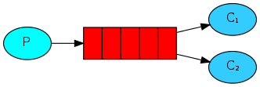
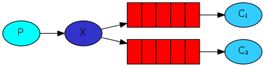
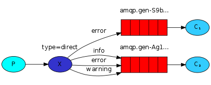
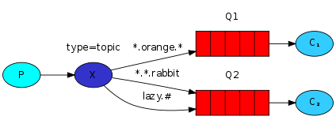
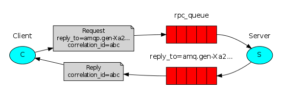

# Exemplos em Java com RabbitMQ

O servidor RabbitMQ é um *broker* de mensagens que implementa o protocolo AMQP (*Advanced Message Queuing Protocol*). O RabbitMQ é um sistema de mensagens que permite a comunicação entre diferentes aplicações, facilitando a troca de informações de forma assíncrona e escalável.

Neste repositório são apresentados exemplos do tutorial oficial do RabbitMQ. Cada exemplo é um programa Java que utiliza a biblioteca [RabbitMQ Java Client](https://www.rabbitmq.com/java-client.html) para se comunicar com o servidor RabbitMQ.


## Servidor RabbitMQ

Para executar os exemplos, é necessário ter um servidor RabbitMQ em execução. Neste projeto, utilizamos o RabbitMQ na versão `3-management-alpine`, que é uma imagem leve do RabbitMQ com a interface de gerenciamento habilitada.

Para facilitar o processo de instalação e configuração do RabbitMQ, utilizamos o Docker. Assim, não é necessário instalar o RabbitMQ diretamente na máquina, mas sim executar um contêiner Docker com o RabbitMQ já configurado.

```bash
docker run --rm -p 15672:15672 -p 5672:5672 rabbitmq:3-management-alpine
```
>[!note]
> Após executar o comando acima, o servidor RabbitMQ estará em execução e pronto para aceitar conexões na porta `5672` (porta padrão do AMQP) e a interface de gerenciamento estará disponível na porta `15672` (porta padrão da interface de gerenciamento do RabbitMQ). 
>
> Acesse a interface de gerenciamento em [http://localhost:15672](http://localhost:15672), com o usuário e senha padrão `guest/guest`. Na interface, você poderá monitorar e gerenciar o servidor RabbitMQ, incluindo filas, trocas, conexões e muito mais.


## Instruções para execução dos exemplos

Cada exemplo é composto por dois programas, geralmente, um produtor e um consumidor. No arquivo [build.gradle](build.gradle) foram criadas [tarefas gradle](https://docs.gradle.org/current/dsl/org.gradle.api.tasks.JavaExec.html) para facilitar a execução de cada exemplo. Para cada exemplo foram criadas 2 tarefas e todas estestão dentro do grupo `execution` do gradle. 

No arquivo [conexao.properties](src/main/resources/conexao.properties) estão contidas as informações sobre o `host`, `username` e `password` do servidor RabbitMQ que será utilizado nos exemplos em Java. Por padrão, o usuário e senha são `guest/guest`, que são os valores padrão do RabbitMQ.


A explicação do funcionamento de cada exemplo pode ser obtida na [documentação oficial do RabbitMQ](http://www.rabbitmq.com/getstarted.html)

### Exemplo 01 - Hello world!


Neste exemplo, um produtor envia uma mensagem para uma fila e um consumidor recebe essa mensagem. Se você executar o exemplo várias vezes, verá que o consumidor receberá todas as mensagens enviadas pelo produtor, mesmo que o consumidor não esteja em execução no momento em que as mensagens são enviadas.


- Execute o consumidor para que ele esteja pronto para receber mensagens.
    ```bash
    ./gradlew -q ex01Consumidor
    ```
- Execute o produtor para enviar uma mensagem.
    ```bash
    ./gradlew -q ex01Produtor
    ```

### Exemplo 02 - Work queues



Neste exemplo, um produtor envia mensagens para uma fila e vários consumidores (trabalhadores) recebem essas mensagens. O objetivo é distribuir as tarefas entre os trabalhadores de forma equilibrada, utilizando o padrão varredura cíclica (*round robin*).

- Execute o trabalhador em três terminais diferentes.
    ```bash
    ./gradlew -q ex02Trabalhador
    ```
- Execute o produtor para enviar mensagens. Cada ponto na mensagem representa 1 segundo de trabalho para o trabalhador.
    ```bash
    ./gradlew -q ex02Tarefa --args ". . ."
    ```

### Exemplo 03 - Publish / Subscribe



Neste exemplo, um produtor envia mensagens para uma *exchange* e vários consumidores recebem essas mensagens. O objetivo é demonstrar o padrão de publicação/assinatura (*publish/subscribe*), onde as mensagens são enviadas para todos os consumidores conectados à *exchange*.

- Execute o receptor em dois terminais diferentes.
    ```bash
    ./gradlew -q ex03Receptor
    ```
- Execute o produtor para enviar mensagens.
    ```bash
    ./gradlew -q ex03Produtor --args "sistemas distribuídos"
    ```

### Exemplo 04 - Routing



Neste exemplo, um produtor envia mensagens para uma *exchange* com base em uma chave de roteamento. Vários consumidores recebem essas mensagens, mas cada consumidor está interessado apenas em mensagens com uma chave de roteamento específica. O objetivo é demonstrar o padrão de roteamento, onde as mensagens são enviadas para filas específicas com base na chave de roteamento.

- Execute o receptor em dois terminais diferentes com a chave de roteamento "info".
    ```bash
    ./gradlew -q ex04Receptor --args "info"
    ```
- Execute o receptor em um novo terminal com uma chave de roteamento "std".
    ```bash
    ./gradlew -q ex04Receptor --args "std"
    ```
- Em seguida, abra um novo terminal e execute o emissor para enviar mensagens. Use "info" ou "std" como argumento.
    ```bash
    ./gradlew -q ex04Emissor --args "info"
    ```

### Exemplo 05 - Topics



Neste exemplo, um produtor envia mensagens para uma *exchange* com base em padrões de texto (tópicos). Vários consumidores recebem essas mensagens, mas cada consumidor está interessado apenas em mensagens que correspondam a um padrão específico. O objetivo é demonstrar o padrão de tópicos, onde as mensagens são enviadas para filas específicas com base em padrões de texto.

- Execute o receptor em dois terminais diferentes com padrões específicos.
    ```bash
    ./gradlew -q ex05Receptor --args "std.aula"
    ```
    ```bash
    ./gradlew -q ex05Receptor --args "std.prova"
    ```
- Execute o receptor em um novo terminal com um padrão mais amplo.
    ```bash
    ./gradlew -q ex05Receptor --args "std.*"
    ```
- Execute o emissor para enviar mensagens com o padrão "std.aula".
    ```bash
    ./gradlew -q ex05Emissor --args "std.aula"
    ```


### Exemplo 06 - RPC



Neste exemplo, um cliente envia uma solicitação para um servidor e aguarda uma resposta. O objetivo é demonstrar o padrão de chamada de procedimento remoto (*RPC*), onde o cliente faz uma solicitação ao servidor e recebe uma resposta.

- Execute o servidor para que ele esteja pronto para receber solicitações.
    ```bash
    ./gradlew -q ex06Servidor
    ```
- Em seguida, execute o cliente para enviar uma solicitação e receber uma resposta.
    ```bash
    ./gradlew -q ex06Cliente
    ```

Agora, faça o contrário, suba o cliente primeiro e depois o servidor, para ver como o cliente aguarda a resposta do servidor.


## Referências 

- https://github.com/rabbitmq/rabbitmq-tutorials
- http://www.rabbitmq.com/getstarted.html
